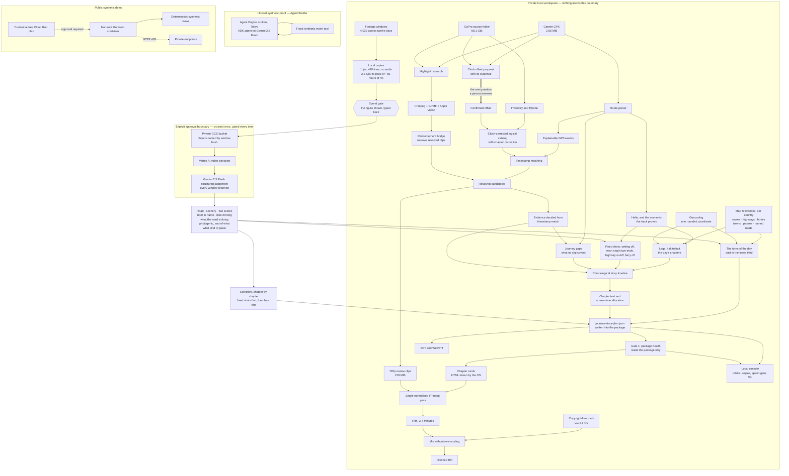

# Ride Storyteller architecture

Redrawn 2026-09-07 to match what runs. The solid local path is complete and has
been executed end to end on real material for twelve consecutive riding days;
the dotted cloud edge remains unimplemented as an uploader and unapproved for
real footage.

## What the diagram is claiming

**The heavy line is the only human input.** Everything else is decided from
evidence. Whether the camera's clock agreed with the GPS cannot be settled from
the data — a camera thirteen hours out and a ride thirteen hours later are the
same data — so the system proposes an offset with its evidence and a person
confirms one number. On the real ride that recovered −46,800 s from 49
recordings, unambiguously.

**Highlight research is connected, not handed off.** An earlier version of this
diagram marked it as a manual gap. It now narrows already-resolved clips
through the reinforcement bridge, failing closed on any ambiguous or
cross-asset case.

**Gaps are first-class.** What no clip covers becomes part of the story rather
than a hole: journey gaps join the confirmed footage on one chronological
timeline, take chapter text derived only from what the track proves, and are
allocated screen time.

**The plan is written down.** `journey-story-plan.json` is what makes Gate 1
able to measure the film rather than only its footage, and what the renderer
cuts against. One artifact, so both agree on what the film is.

**Pixels are read late, and leave small.** Everything up to the footage
windows runs on the GPS track and video metadata. What leaves the machine is
the local copies of those windows — 2.3 GiB across twelve days, in place of
some fifty hours of 4K — and the source video never moves. Objects in the
bucket are named by the window's hash, never by a recording's file name or
capture time.

**The map is a separate, thin edge.** Which road is a scenic route, where the
towns and passes are, which water a ferry crosses: fetched once per country
from OpenStreetMap by country code alone, stored outside version control, and
matched offline. Place names are asked of Geocoding one rounded coordinate at a
time — four decimals, about ten metres — and cached in the package, so a re-cut
asks nothing again. Neither edge is told anything about the ride.

**The model answers more than two scores.** What it says about the rider, the
bike standing still, what the road is doing, how photogenic a frame is and of
what, and what kind of place the bike is at, is what lets the film cut on the
moment of setting off, keep the rider's reflection out, open on four pictures,
and say at each stop what the stop was.

**The model decides the film; the gate decides the spend.** Gemini's judgement
of every window is what selection ranks, and the film is cut from what it
scored highest, spread along the ride. Nothing is sent until the console has
shown what it would cost and that exact figure has been typed back. A
judgement that breaks part-way keeps what was paid for; a film is never cut
from a judgement no model was paid for.

## What the diagram is not claiming

- The cloud edge is crossed only through the spend gate, and only by the local
  copies. It was crossed for the first time on 2026-09-03, with approval, and
  has since carried twelve days: 4,039 stored judgements for about ¥764 in
  total, some windows bought twice as the questions grew. The 4K source
  has never left the machine.
- The hosted runtime is a synthetic execution proof. It has no tool that can
  read the private workspace and has only ever received fixed synthetic events.
- The public-demo container is deployed as a **private** Tokyo Cloud Run
  revision. Authenticated health and synthetic-demo requests pass; private and
  Google-execution routes, and every unauthenticated request, are blocked.
  Public IAM remains a separate approval. The container cannot invoke Gemini,
  the hosted runtime, Maps, or private processing.
