# Ride Storyteller architecture

```mermaid
flowchart LR
    subgraph Local["Private local workspace"]
        GPX["Garmin GPX"] --> Parser["Route parser"]
        Parser --> Events["Explainable GPS events"]
        Events --> Story["Story Agent"]
        Media["GoPro source folder"] --> Inventory["Inventory and ffprobe"]
        Inventory --> Catalog["Clock-corrected logical catalog<br/>with chapter correction"]
        Story -->|"requests evidence"| Query["Candidate interval"]
        Query --> Catalog
        Catalog --> Candidate["Timestamp-resolved candidate"]
        Candidate --> ReviewClips["720p review clips"]

        GPX --> Highlight["Highlight research"]
        Media --> Highlight
        Highlight --> Metrics["FFmpeg + GPMF + Apple Vision"]
        Metrics --> Ranked["Four ranked review sets"]
        Ranked -. "manual handoff; not integrated yet" .-> Review["Human evidence review"]
        ReviewClips --> Review
        Review --> Gate["Evidence and duration gate"]
        Gate --> LocalRender["Silent local draft render"]
    end

    subgraph ApprovedCloud["Separate explicit approval boundary"]
        GCS["Approved short GCS object"] --> Transport["Vertex AI video transport"]
        Transport --> Gemini["Gemini structured analysis"]
    end

    Candidate -. "no automatic upload" .-> GCS
    Gemini --> Analysis["Validated VideoAnalysis"]
    Analysis --> Decision["Confirm, reject, or human review"]
    Decision --> Gate
    Gate --> Plan["Inspectable FFmpeg plan"]
    Plan --> Human["Human-reviewed final edit"]

    subgraph SyntheticRuntime["Hosted synthetic proof"]
        Runtime["Tokyo Agent Platform Runtime"] --> Tool["Fixed synthetic event tool"]
        Tool --> Runtime
    end

    subgraph PublicDemo["Optional public synthetic demo"]
        Container["Non-root Gunicorn container"] --> SafeViews["Deterministic synthetic views"]
        Container -. "HTTP 403" .-> PrivateEndpoint["Private GPX endpoint"]
        Plan["Credential-free Cloud Run plan"] -. "approval required" .-> Container
    end
```

The solid local path can be prepared without video transfer. The real-media
v4a run verified catalog correction, 2,385-window analysis, GPMF and local Apple
Vision evidence, four review sets, and private clip extraction. Highlight output
is not yet connected to Story Plan or the evidence-review contract; the dashed
manual handoff is a current architectural gap, not a completed agent edge.

The dotted cloud edge is not implemented as an uploader: a separate approved
process must create the short GCS object. The hosted Runtime is a synthetic
execution proof and has no tool that can read the private workspace. The
public-demo container is deployed as a private Tokyo Cloud Run revision.
Authenticated health and synthetic-demo requests pass, while private/Google
execution routes and every unauthenticated request remain blocked. Public IAM
is still a separate approval. The container cannot invoke Gemini, the hosted
Runtime, Maps, or private GPX processing.
