# Ride Storyteller architecture

```mermaid
flowchart LR
    subgraph Local["Private local workspace"]
        GPX["Garmin GPX"] --> Parser["Route parser"]
        Parser --> Events["Explainable GPS events"]
        Events --> Story["Story Agent"]
        Story -->|"requests evidence"| Query["Candidate interval"]
        Media["GoPro source folder"] --> Inventory["Inventory and ffprobe"]
        Inventory --> Catalog["Clock-corrected local catalog"]
        Query --> Catalog
        Catalog --> Candidate["Resolved candidate clip"]
    end

    subgraph ApprovedCloud["Separate explicit approval boundary"]
        GCS["Approved short GCS object"] --> Transport["Vertex AI video transport"]
        Transport --> Gemini["Gemini structured analysis"]
    end

    Candidate -. "no automatic upload" .-> GCS
    Gemini --> Analysis["Validated VideoAnalysis"]
    Analysis --> Decision["Confirm, reject, or human review"]
    Decision --> Gate["Evidence and duration gate"]
    Gate --> Plan["Inspectable FFmpeg plan"]
    Plan --> Human["Human-reviewed final edit"]

    subgraph SyntheticRuntime["Hosted synthetic proof"]
        Runtime["Tokyo Agent Platform Runtime"] --> Tool["Fixed synthetic event tool"]
        Tool --> Runtime
    end

    subgraph PublicDemo["Optional public synthetic demo"]
        Container["Non-root Gunicorn container"] --> SafeViews["Deterministic synthetic views"]
        Container -. "HTTP 403" .-> PrivateEndpoint["Private GPX endpoint"]
        Plan["Credential-free Cloud Run plan"] -. "approval required" .-> Container
    end
```

The solid local path can be prepared without video transfer. The dotted edge is
not implemented as an uploader: a separate approved process must create the
short GCS object. The hosted Runtime is a synthetic execution proof and has no
tool that can read the private workspace. The public-demo container is prepared
and verified locally as `linux/amd64`, but it has not been deployed to Cloud
Run. Its deployment plan separates private resource creation from public IAM. It
cannot invoke Gemini, the hosted Runtime, Maps, or private GPX processing.
